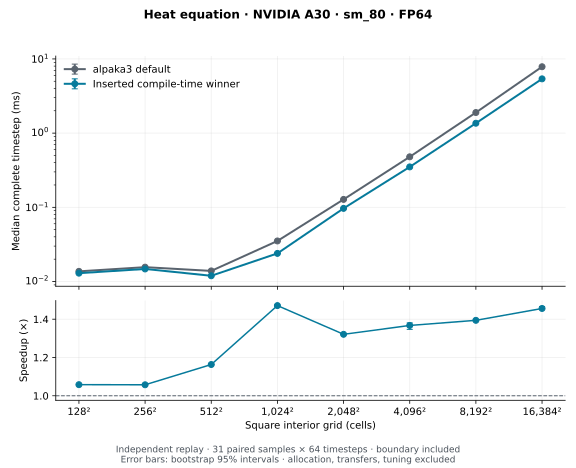
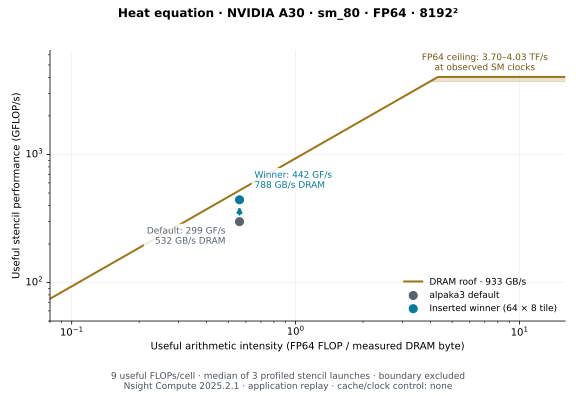
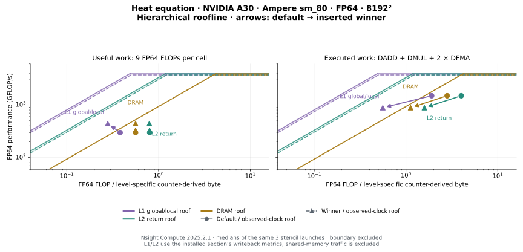
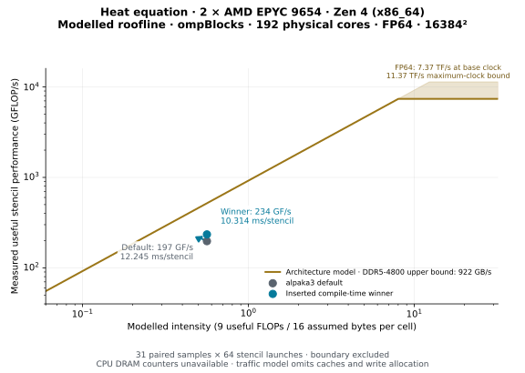

# Heat-equation stencil tuning

Compare the original alpaka3 FP64 heat-equation stencil with compile-time
specializations selected by alpakaTune. The benchmark uses the original
stencil and boundary kernels from the configured alpaka3 source tree. Every
implementation advances the same five-point equation with the same precision,
coefficients, and boundary conditions.

## Measured NVIDIA A30 comparison

The inserted specializations were rebuilt and measured independently on
2026-10-08: NVIDIA A30, Ampere `sm_80`, FP64, CUDA 12.9.1, driver 610.57.04,
GCC 14.3.0, Release, fast math and flush-to-zero disabled. The original kernels
come from alpaka3 revision `b7d339d07056a9a2a6c4051cc3927157bc5f0d51`.
These are medians of 31 paired samples of 64 complete timesteps, including
the original boundary kernel. Tuning, allocation, and transfers are excluded.

| Interior grid | Default ms/step | Inserted ms/step | Speedup | 95% interval |
|---|---:|---:|---:|---:|
| 128² | 0.013712 | 0.012960 | 1.058× | 1.057–1.059 |
| 256² | 0.015616 | 0.014768 | 1.057× | 1.055–1.064 |
| 512² | 0.013904 | 0.011952 | 1.163× | 1.162–1.165 |
| 1024² | 0.035216 | 0.023936 | 1.471× | 1.467–1.474 |
| 2048² | 0.127872 | 0.096784 | 1.321× | 1.320–1.325 |
| 4096² | 0.479408 | 0.350576 | 1.367× | 1.347–1.381 |
| 8192² | 1.894848 | 1.359056 | 1.394× | 1.393–1.398 |
| 16384² | 7.847232 | 5.388768 | 1.456× | 1.455–1.466 |



At 8192², Nsight Compute 2025.2.1 measured three stencil launches after eight
preceding timesteps, using application replay with cache and clock control
disabled. The selected 64 by 8 register tile uses 64 by 2 workers and four rows
per worker. Median stencil duration fell from 2.022 ms to 1.365 ms, while
measured DRAM bandwidth rose from 532 to 788 GB/s. Effective traffic stayed
near 1.075 GB per stencil. The jump is higher achieved bandwidth.

The plot counts nine useful FP64 stencil FLOPs per cell for both kernels,
excluding coefficient setup. Intensity is useful FLOP/s divided by measured
DRAM byte/s. Effective bytes normalize that measured bandwidth to the kernel
duration; they are not a source-level load estimate. Executed FP64 instruction
rates differ because the implementations repeat different amounts of coefficient
work. The DRAM ceiling is 933 GB/s; the shaded FP64 ceiling range reflects
the SM clocks observed in the two profiles. The boundary kernel is excluded.



The figures are also available as PNG and PDF. Their numeric data are in
[runtime.csv](figures/a30/runtime.csv) and
[roofline.csv](figures/a30/roofline.csv). Results describe these device, size,
precision, and compiler conditions; small grids remain dominated by launch
and boundary overhead.

## Hierarchical GPU roofline

The same saved Nsight Compute reports contain the L1, L2, and DRAM counters.
The hierarchical plot uses the installed
`SpeedOfLight_HierarchicalDoubleRooflineChart` definitions for `sm_80`:
L1 global/local writeback-active cycles multiplied by 128 bytes, L2-to-crossbar
active cycles multiplied by 32 bytes, and total DRAM byte rate. These are
counter-derived traffic proxies for the selected paths. L1 excludes shared
memory; L2 counts return traffic toward the SMs, whereas DRAM includes reads
and writes. Their byte totals therefore describe different traffic scopes.

Each level has its own arithmetic intensity and default-to-winner arrow.
Solid and dashed roofs use the default and winner's observed clock rates.
The left panel holds useful work fixed at nine FP64 FLOPs per cell. The right
panel follows Nsight Compute's executed-operation convention:
DADD + DMUL + twice DFMA. Hardware compute utilization should be read from
that executed-work panel. A useful-work point below the compute roof can also
reflect extra arithmetic executed by the implementation.



| Counter path | Default GB/s | Winner GB/s | Default % of path roof | Winner % of path roof |
|---|---:|---:|---:|---:|
| L1 global/local writeback | 784 | 1583 | 9.7% | 21.4% |
| L2 return toward SMs | 373 | 557 | 11.2% | 18.3% |
| DRAM reads and writes | 532 | 788 | 57.0% | 84.5% |

DRAM is the closest of these measured bandwidth paths to its roof. L1 and L2
have substantially more bandwidth headroom. This supports DRAM bandwidth as
a major constraint for the winner at this size, but does not prove it is the
only bottleneck or explain every source of the speedup.

The winner's L1 traffic proxy increases from 1.585 to 2.161 GB per launch,
consistent with replacing shared-memory staging with global loads and register
reuse. L2 return traffic stays near 0.75–0.76 GB, and DRAM traffic near 1.075 GB.
The useful rate rises from 299 to 442 GFLOP/s, while the executed rate falls
from 1494 to 885 GFLOP/s: reducing repeated coefficient arithmetic is part of
the change. Both kernels use 32 registers per thread, and achieved occupancy
is similar (93.7% versus 91.3%). These measurements do not isolate a causal
contribution from instruction issue, shared-memory operations, or stalls.

The [numeric data](figures/a30/hierarchical-roofline.csv) include all three
launches per implementation, traffic rates, path ceilings, both operation
counts, and occupancy. PNG and PDF copies accompany the SVG. See the
[NVIDIA roofline guide](https://docs.nvidia.com/nsight-compute/ProfilingGuide/index.html#roofline-charts)
for the hierarchical interpretation. The CPU roofline below remains modeled;
CPU cache and DRAM counters were not collected, so a measured CPU hierarchical
roofline cannot be inferred from these timings.

## Measured AMD EPYC 9654 comparison

The CPU winners were rebuilt and independently measured on 2026-10-08 using
`ompBlocks` on an exclusive dual-socket AMD EPYC 9654 node: Zen 4 (Genoa),
192 physical cores, SMT disabled, FP64, GCC 14.3.0, Release, `-march=znver4`.
OpenMP used 192 threads with core placement, spread binding, dynamic teams
disabled, and active waiting. Memory was interleaved across NUMA nodes.
Fast math and flush-to-zero were disabled. The upstream revision and paired
sample protocol match the GPU comparison.

| Interior grid | Default ms/step | Inserted ms/step | Speedup | 95% interval |
|---|---:|---:|---:|---:|
| 128² | 0.121458 | 0.120200 | 1.010× | 0.985–1.042 |
| 256² | 0.121755 | 0.120073 | 1.014× | 1.004–1.023 |
| 512² | 0.129014 | 0.124297 | 1.038× | 1.033–1.050 |
| 1024² | 0.154315 | 0.154067 | 1.002× | 0.990–1.009 |
| 2048² | 0.244781 | 0.216130 | 1.133× | 1.117–1.143 |
| 4096² | 0.585895 | 0.367787 | 1.593× | 1.585–1.612 |
| 8192² | 2.126710 | 1.320040 | 1.611× | 1.560–1.624 |
| 16384² | 12.808200 | 10.590500 | 1.209× | 1.207–1.213 |


The inserted configurations reduce complete timestep time by 37–38% at
4096²–8192² and 17% at 16384². The original was deliberately retained at
1024²: the search finalist improved isolated stencil time but slightly
regressed complete timesteps. The 128² interval does not establish a gain.

CPU DRAM hardware counters were unavailable. The following roofline therefore
uses measured stencil times with an explicitly modeled intensity: nine useful
FP64 FLOPs and an assumed 16 bytes per cell (one read and one write). This
ideal traffic model omits cache effects and write allocation. At 16384²,
stencil duration falls from 12.245 to 10.314 ms, raising useful performance
from 197 to 234 GFLOP/s.

The memory ceiling is the architectural DDR5-4800 upper bound of
2 × 460.8 GB/s, not measured node bandwidth. The nominal FP64 ceiling is
192 × 2.4 GHz × 16 FLOPs/cycle = 7.37 TFLOP/s. The shaded upper bound uses
the specified 3.7 GHz maximum clock, which is not an achievable all-core
frequency claim. Specifications come from the
[AMD EPYC 9654 product page](https://www.amd.com/en/products/processors/server/epyc/4th-generation-9004-and-8004-series/amd-epyc-9654.html)
and AMD's [FP64 throughput calculation](https://community.amd.com/t5/server-processors/leadership-hpc-performance-with-5th-generation-amd-epyc/ba-p/739498/jump-to/first-unread-message).



PNG and PDF versions accompany both figures. Numeric data and measurement
conditions are in [runtime.csv](figures/genoa/runtime.csv),
[roofline.csv](figures/genoa/roofline.csv), and
[provenance.json](figures/genoa/provenance.json).
The GPU [provenance](figures/a30/provenance.json) identifies its measured source
snapshot. GPU measurements preceded the addition of startup identity checks;
those checks do not change kernels or timed sections. The guarded GPU replay
was subsequently rebuilt and its startup checks exercised. CPU measurements
use the guarded replay.

## Build and search

Build the search executable on the accelerator machine:

```sh
cmake -S . -B build/heat -G Ninja \
  -DCMAKE_BUILD_TYPE=Release \
  -DalpakaTune_BUILD_BENCHMARKS=ON -DalpakaTune_GEMM_VENDOR=OFF \
  -Dalpaka_DEP_CUDA=ON -DCMAKE_CUDA_ARCHITECTURES=80 \
  -Dalpaka_FAST_MATH=OFF -Dalpaka_FTZ=OFF
cmake --build build/heat --target alpakaTune_heatEquation -j 2
build/heat/benchmarks/heatEquation/alpakaTune_heatEquation \
  --backend cuda:nvidiaGpu --executor gpuCuda --self-test
build/heat/benchmarks/heatEquation/alpakaTune_heatEquation \
  --backend cuda:nvidiaGpu --executor gpuCuda \
  --csv benchmarks/results/heat-search.csv \
  --export-winners benchmarks/results/HeatWinners.hpp
```

Architecture `80` targets Ampere GPUs; select the architecture of your device.
When supplying alpaka through an existing CMake target, set
`alpakaTune_HEAT_UPSTREAM_SOURCE` to its source tree. Set
`alpakaTune_HEAT_SOURCE_REVISION` to the source revision or snapshot identity
you want recorded with measurements.

The default size sweep uses square interior grids from 128 to 16384 cells per
side, doubling at each point. Repeat `--size N` to choose sizes. Benchmark
sizes must be divisible by 16, matching the original kernel's precondition.
`--self-test` also checks irregular grids for the optimized kernels.

## Candidate space

The catalog couples tile dimensions, worker layout, and work per worker:

| Family | Worker layout `(x,y)` | Rows per worker | Shared row padding | Variants |
|---|---|---|---|---:|
| Original | Original 16 by 16 tile and launch conversion | 1 | 0 | 1 |
| Shared | x = 32/64, y = 2/4/8; or x = 128, y = 1/2/4 | 1/2/4 | 0/1 | 54 |
| Direct loads | x = 32/64/128, y = 1/2 | 1/2/4 | — | 18 |
| Register streaming | x = 32/64/128, y = 1/2 | 2/4/8 | — | 18 |

For optimized kernels, tile width equals worker width and tile height equals
worker height times rows per worker. Shared variants load the tile and halo
cooperatively. Direct variants rely on global-memory caching. Register variants
reuse a sliding window of vertically adjacent values.

Each optimized layout tests one block per tile and grids capped at two or
eight blocks per multiprocessor. Equivalent grids are deduplicated. The
original keeps its original launch. There are at most 271 legal candidates
per shape; device resource limits can reduce the count. The catalog covers
spatial tuning of one timestep.

The search instantiates `CVals` kernel variants and restricts runtime launch
geometry to compatible layout/grid pairs. Exhaustive exploration uses nine
measured samples per candidate by default. The application supplies device-event
timing of repeated stencil launches through `elapsedTimeMetric()`. Each sample
targets a 10 ms interval, bounded to 4096 launches, and is divided by the batch
length. Candidate activations have two warm-up launches followed by a measured
sample. The five fastest candidates and the original are retested in shuffled
order with at least 31 fresh samples before selection.

## Insert and replay the winner

Inspect the exported header and its finalist measurements. Copy it into
`benchmarks/heatEquation/SelectedWinners.hpp`, then rebuild the replay target:

```sh
cp benchmarks/results/HeatWinners.hpp \
  benchmarks/heatEquation/SelectedWinners.hpp
cmake --build build/heat --target alpakaTune_heatEquation_replay -j 2
build/heat/benchmarks/heatEquation/alpakaTune_heatEquation_replay \
  --backend cuda:nvidiaGpu --executor gpuCuda \
  --csv benchmarks/results/heat-replay.csv
```

The replay executable compiles the inserted specializations and launches them
directly. Search scheduling and catalog dispatch are absent from its timed
sections. Inserted winners are specific to the measured device, architecture,
executor, catalog, core count, and OpenMP thread count. Replay rejects mismatches.
Each size has its own selected configuration; this is not a claim that one
configuration is best for every size or device.

For `ompBlocks`, configure with `alpaka_DEP_OMP=ON`,
`alpaka_EXEC_CpuOmpBlocks=ON`, and `alpakaTune_HEAT_CPU_CATALOG=ON`.
The CPU catalog contains the original, 16 direct tiles (width 64/128/256/512,
height 1/4/16/64), 24 shared tiles (width 32/64/128/256, height 4/8/16,
padding 0/1), and eight register tiles (width 64/128, worker height 1/4,
rows 2/4). Logical tile workers execute serially within each OpenMP block;
blocks run in parallel. Grid caps use the device's core count. Set
`alpakaTune_HEAT_WINNERS_HEADER` to a separate exported CPU header before
building the replay target. The provided `SelectedWinnersCpu.hpp` targets a
dual-socket EPYC 9654 with 192 OpenMP threads and the CPU catalog.
Run with `--backend host:cpu --executor ompBlocks`.
Record the CPU model, architecture, allocated cores, OpenMP thread count and
affinity, compiler ISA target, and NUMA placement. Use a dedicated whole-node
allocation for CPU performance measurements.

Evaluation defaults to 31 paired samples of 64 complete timesteps after three
warm-up samples. Implementation order alternates. Initial-state restoration,
transfers, allocation, and correctness checks are outside timing. Every timestep
includes the unchanged original boundary kernel. Stencil-only timing and
synchronized host duration are recorded separately.

`FILE.csv` contains medians and paired-bootstrap 95% speedup intervals.
`FILE.csv.samples.csv` retains evaluation samples;
`FILE.csv.tuning.csv` retains search observations;
`FILE.csv.finalists.csv` retains independent finalist samples;
`FILE.csv.metadata.json` identifies the device, architecture, backend, executor,
source identity, seed, and sample counts. Runtime medians exclude tuning cost.
An interval containing one does not establish a speedup.

The self-test compares every legal layout/grid pair against an independent
host recurrence for seven steps, including irregular edges and halos. Complete
benchmark simulations also run the upstream analytic check with its original
tolerance. Both catalogs passed the default 16², 31², 64², and 67² self-tests.
Additional 257² GPU and 513² CPU checks passed 184 and 80 legal layout/grid
pairs respectively, exercising capped grids. The CPU replay also correctly
rejected a thread-count mismatch.

## Roofline comparison

Use a fixed size and the inserted replay executable for both profiles:

```sh
build/heat/benchmarks/heatEquation/alpakaTune_heatEquation_replay \
  --backend cuda:nvidiaGpu --executor gpuCuda \
  --size 8192 --steps 16 --profile default
build/heat/benchmarks/heatEquation/alpakaTune_heatEquation_replay \
  --backend cuda:nvidiaGpu --executor gpuCuda \
  --size 8192 --steps 16 --profile winner
```

Collect stencil hardware counters with the installed Nsight Compute version,
using its FP64 roofline section and a matching cache/replay policy. Exclude the
boundary kernel from this stencil roofline. Arithmetic intensity uses measured
traffic at the selected memory level; source-level load counts do not measure
DRAM traffic. Match the operation count, elapsed interval, and FP64 compute
ceiling. The [Nsight Compute profiling guide](https://docs.nvidia.com/nsight-compute/ProfilingGuide/index.html#roofline-charts)
describes the roofline sections and interpretation.

Label runtime and roofline plots with the GPU model, architecture, precision,
and problem size. Connect the default and selected roofline points with an
arrow, and keep the profiler measurements separate from unprofiled runtime
samples.
