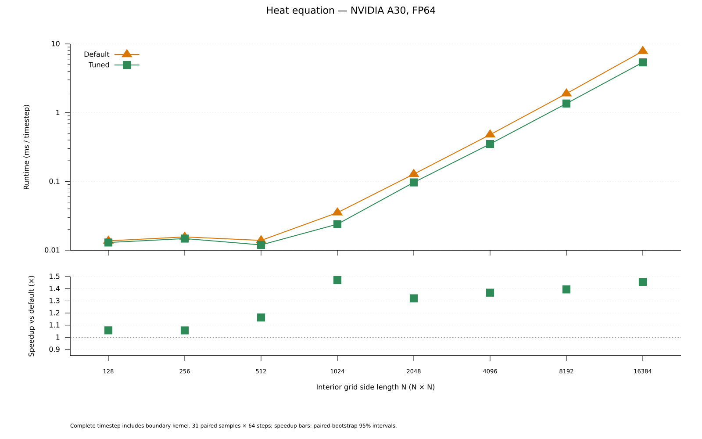
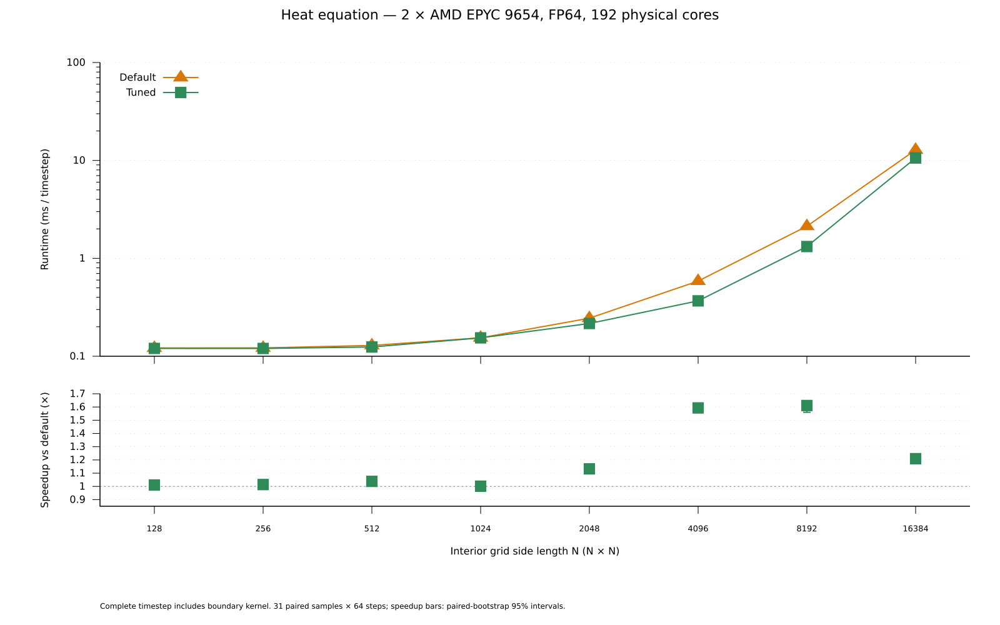
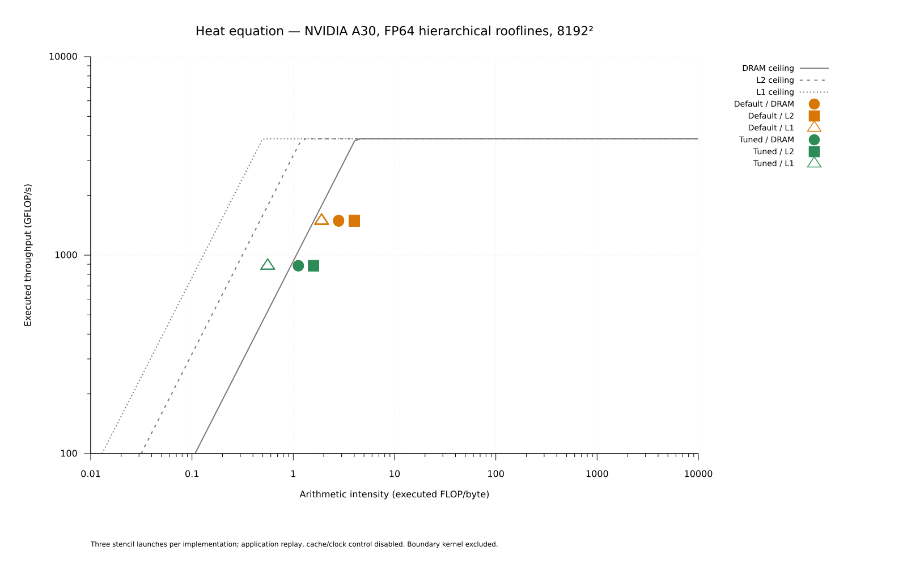

# Heat-equation stencil tuning

Tune the original alpaka3 FP64 five-point stencil and export compile-time
specializations. Every path uses the same equation, coefficients, precision,
and original boundary kernel. The search and compiled-winner replay are
separate executables.

## Build, tune, and replay

From the repository root:

```sh
cmake -S . -B build/heat -G Ninja -DCMAKE_BUILD_TYPE=Release \
  -DalpakaTune_BUILD_EXAMPLES=ON \
  -Dalpaka_DEP_CUDA=ON -DCMAKE_CUDA_ARCHITECTURES=80 \
  -Dalpaka_FAST_MATH=OFF -Dalpaka_FTZ=OFF
cmake --build build/heat --target alpakaTune_heatEquation -j 2
build/heat/example/heatEquation/alpakaTune_heatEquation \
  --backend cuda:nvidiaGpu --executor gpuCuda \
  --csv build/heat/results/heat-search.csv \
  --export-winners build/heat/results/HeatWinners.hpp
cp build/heat/results/HeatWinners.hpp example/heatEquation/SelectedWinners.hpp
cmake --build build/heat --target alpakaTune_heatEquation_replay -j 2
build/heat/example/heatEquation/alpakaTune_heatEquation_replay \
  --backend cuda:nvidiaGpu --executor gpuCuda \
  --csv build/heat/results/heat-replay.csv
```

Repeat `--size N` to select square interior grids; defaults span 128²–16384².
Sizes must be divisible by 16 for the original stencil. `--self-test` also
checks optimized kernels on irregular grids. If using an existing alpaka target,
set `alpakaTune_HEAT_UPSTREAM_SOURCE` to its source tree.

The GPU catalog couples worker layouts, rows per worker, shared padding, and
full grids or grids capped at two/eight blocks per multiprocessor. It contains
shared-memory, direct-load, and register-streaming variants: at most 271 legal
configurations per shape. Exhaustive search takes nine samples per candidate;
the five fastest and the original are retested with at least 31 fresh samples.

For OpenMP, enable `alpaka_DEP_OMP`, `alpaka_EXEC_CpuOmpBlocks`, and
`alpakaTune_HEAT_CPU_CATALOG`; disable CUDA and set
`alpakaTune_HEAT_WINNERS_HEADER` to the absolute path of `SelectedWinnersCpu.hpp`.
Run with `--backend host:cpu --executor ompBlocks`. Its catalog contains
49 layouts with core-count grid caps; logical tile workers execute serially
within each block while blocks run in parallel.

The shipped [GPU winners](SelectedWinners.hpp) target NVIDIA A30;
[CPU winners](SelectedWinnersCpu.hpp) target dual EPYC 9654 with 192 OpenMP
threads. Replay compiles only inserted specializations and rejects mismatched
device, architecture, executor, catalog, core count, or team size.
The original is retained for the CPU 1024² case because its complete timestep
was faster than the search finalist.

## GPU runtime and speedup



The selected configurations reduce complete timestep runtime by **32.0%
(1.47× faster)** at 1024² and **31.3% (1.46× faster)** at 16384².
Small grids remain dominated by launch and boundary overhead.

## CPU runtime and speedup



Both paths use the same exclusive dual-socket AMD EPYC 9654 node:
**192 physical cores, SMT disabled, 192 OpenMP threads**. Runtime falls by
**37.9% (1.61× faster)** at 8192². The 128² speedup interval includes one
and does not establish an improvement.

## DRAM, L2, and L1 rooflines



Nsight Compute 2025.2.1 profiled three stencil launches per implementation
at 8192² after eight timesteps, using application replay with cache and clock
control disabled. Boundary kernels are excluded. These profiler measurements
are separate from the complete-timestep runtime plots.

Both this plot and the [matmul roofline](../matmul/README.md)
follow NVIDIA's executed-operation convention: DADD + DMUL + twice DFMA for
FP64. Arithmetic intensity divides executed throughput by measured bandwidth
at each level. DRAM counts reads and writes; L2 counts return traffic toward
SMs; L1 covers global/local writeback traffic and excludes shared memory.
Drawn ceilings are medians of the per-launch counter-derived ceilings.

Median DRAM bandwidth rises from **532 to 788 GB/s** against a 933 GB/s ceiling.
L2 rises from 373 to 557 GB/s; L1 from 784 to 1583 GB/s.
Useful throughput rises from 299 to 442 GFLOP/s while executed throughput
falls from 1494 to 885 GFLOP/s because the optimized kernel repeats less
coefficient arithmetic. Thus the lower executed-work point is compatible
with a faster stencil. DRAM is the closest measured bandwidth path to its roof.

## Measurement settings and data

Measurements date from 2026-10-08, using alpaka
`b7d339d07056a9a2a6c4051cc3927157bc5f0d51`, GCC 14.3.0 Release builds,
with fast math and flush-to-zero disabled. GPU: NVIDIA A30, `sm_80`,
CUDA 12.9.1, driver 610.57.04. CPU: Zen 4, `-march=znver4`, core placement,
spread binding, disabled dynamic teams, active waiting, and interleaved NUMA memory.

Runtime medians use 31 paired samples of 64 complete timesteps after three
warmup samples. Implementation order alternates. Tuning, allocation, state
restoration, and transfers are excluded; the original boundary kernel is included.
The lower panels show paired-bootstrap 95% speedup intervals.
Normal runs check the upstream analytic solution; self-tests compare legal
layout/grid pairs against an independent host recurrence.

Numeric data: [GPU runtime](figures/a30/runtime.csv),
[CPU runtime](figures/genoa/runtime.csv), and
[hierarchical roofline](figures/a30/hierarchical-roofline.csv).
[GPU provenance](figures/a30/provenance.json) and
[CPU provenance](figures/genoa/provenance.json) record the measured snapshots.
`--csv FILE` additionally writes samples, tuning observations, finalists,
and metadata next to the summary.

Regenerate both benchmarks' SVGs from the repository root:

```sh
gnuplot example/plots.gnuplot
```
