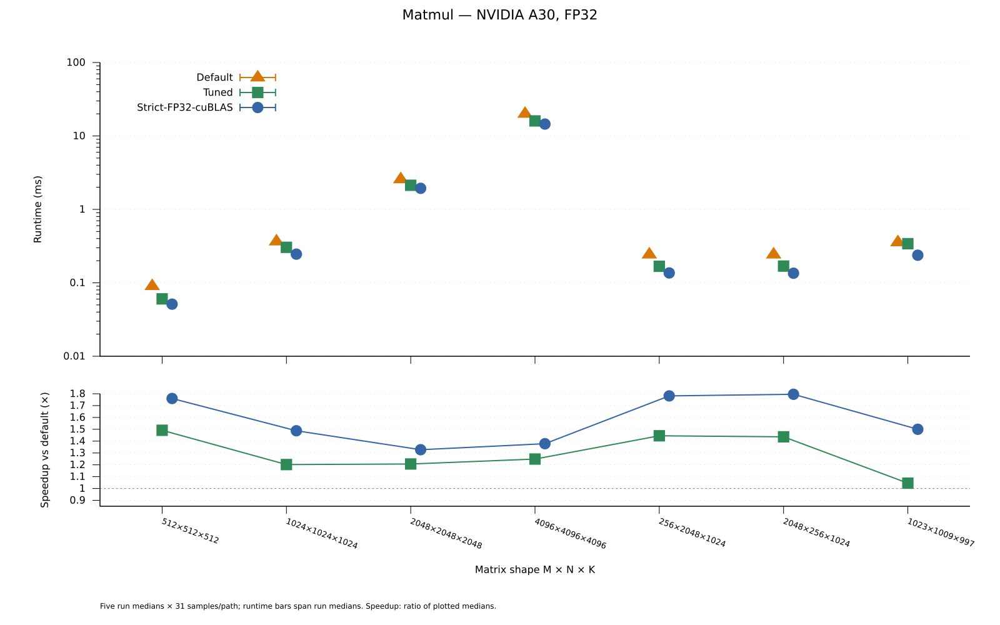
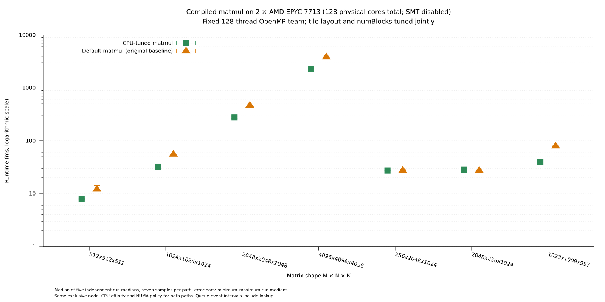
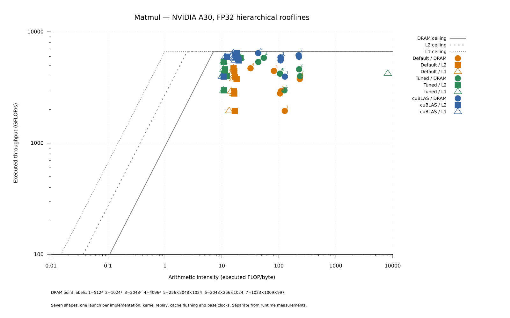

# Compiled matmul winners

Compute row-major FP32 `C[M,N] = A[M,K] * B[K,N]` using the measured
precompiled winner for the input shape and device:

```cpp
#include <example/matmul/Matmul.hpp>

bool const usedWinner = alpakaTune::example::matmul::enqueueMatmul(
    queue, executor, a, b, c);
alpaka::onHost::wait(queue);
```

The catalog supports NVIDIA A30/CUDA and dual AMD EPYC 7713/OpenMP blocks
with 128 CPU processing units and a 128-thread team. Tiles, register layouts,
thread counts, and `numBlocks` are compile-time constants; no runtime tuner
is constructed. Unmatched keys use the original baseline and return `false`.
Buffers must be owning, two-dimensional, on the queue's device, have contiguous
columns, not alias, and remain alive until completion.

Link the example-scoped header target `alpakaTune::matmulExample` to reuse the
call. `enqueueBaseline` provides the comparison baseline; `selectConfiguration`
exposes the typed winner tag. The CPU lookup also takes `CpuContext{128, ompThreads}`.

## Build and run

From the repository root:

```sh
cmake -S . -B build/matmul -DCMAKE_BUILD_TYPE=Release \
  -DalpakaTune_BUILD_EXAMPLES=ON -Dalpaka_DEP_CUDA=ON \
  -DCMAKE_CUDA_ARCHITECTURES=80 -Dalpaka_DEP_OMP=OFF
cmake --build build/matmul --target alpakaTune_matmul -j 2
build/matmul/example/matmul/alpakaTune_matmul \
  --backend cuda:nvidiaGpu --executor gpuCuda --repetitions 31
```

For CPU:

```sh
cmake -S . -B build/matmul-cpu -DCMAKE_BUILD_TYPE=Release \
  -DCMAKE_CXX_FLAGS_RELEASE='-O3 -DNDEBUG -march=znver2' \
  -DalpakaTune_BUILD_EXAMPLES=ON -Dalpaka_DEP_CUDA=OFF \
  -DalpakaTune_MATMUL_CUBLAS=OFF -Dalpaka_DEP_OMP=ON \
  -Dalpaka_DEP_HWLOC=OFF \
  -Dalpaka_EXEC_CpuSerial=OFF -Dalpaka_EXEC_CpuOmpBlocks=ON
cmake --build build/matmul-cpu --target alpakaTune_matmul -j 2
OMP_NUM_THREADS=128 OMP_DYNAMIC=FALSE OMP_PLACES=cores OMP_PROC_BIND=spread \
  build/matmul-cpu/example/matmul/alpakaTune_matmul \
  --backend host:cpu --executor cpuOmpBlocks --repetitions 7
```

Use `--shape MxNxK` to select a shape, `--csv samples.csv` to save timings,
and `--self-test` for full-reference checks of the winner lookup, fallback,
retained layouts, irregular shapes, and bounded grids. CPU winner selection
requires disabled dynamic teams and calls from outside an OpenMP parallel region.

## GPU winners and runtime

The original `LegacyMatmulKernel` uses 64 × 64 × 16 tiles, 4 × 4 registers,
one shared buffer, 256 threads, and the full output grid.
All GPU winners use 128 threads, four-float A padding, register prefetching,
and warp-oriented output mapping. The search also considered 256 and 512 threads.

| Shape M × N × K | Block M × N × K | Registers per thread | Shared buffers | Grid blocks |
|---|---|---|---|---:|
| 512 × 512 × 512 | 32 × 64 × 32 | 4 × 4 | 1 | 128 |
| 1024 × 1024 × 1024 | 32 × 64 × 32 | 4 × 4 | 1 | 512 |
| 2048 × 2048 × 2048 | 32 × 64 × 32 | 4 × 4 | 1 | 2048 |
| 4096 × 4096 × 4096 | 64 × 128 × 32 | 8 × 8 | 1 | 2048 |
| 256 × 2048 × 1024 | 32 × 64 × 32 | 4 × 4 | 1 | 256 |
| 2048 × 256 × 1024 | 32 × 64 × 32 | 4 × 4 | 2, asynchronous | 256 |
| 1023 × 1009 × 997 | 32 × 64 × 32 | 4 × 4 | 1 | 512 |



For 4096³, tuned matmul uses **19.9% less time (1.25× faster)** than default
and takes **10.4% longer than cuBLAS**. For 256 × 2048 × 1024, the reduction
is **30.8% (1.45× faster)**. Gains combine kernel changes and tuning.
The native reference uses a persistent `cublasGemmEx` handle,
`CUBLAS_COMPUTE_32F_PEDANTIC`, `CUBLAS_PEDANTIC_MATH`, and disabled atomics
with `alpha=1`, `beta=0`; TF32 and tensor cores are excluded.

## CPU winners and runtime

The CPU comparison uses the same exclusive **128 physical cores** and
**128-thread OpenMP team** for both paths: two AMD EPYC 7713 CPUs, SMT disabled,
two NUMA domains. Each block uses one physical thread; `numBlocks` is tuned
independently of the team size. The kernel retains the GPU algorithm, with
synchronous copies and logical threads executed in rounds.

The search covered 209 distinct shape/layout/grid configurations, using the
CUDA tile families and full grids or caps of 64, 128, 256, 512, and 1024 blocks.
Candidates passed FP64 reference checks before screening; the two fastest per
shape were independently retested before exporting the winners. Every CPU
winner uses one shared buffer; optimized layouts use four-float A padding
and register prefetching.

| Shape M × N × K | Block M × N × K | Registers per logical thread | Default blocks | Tuned `numBlocks` |
|---|---|---|---:|---:|
| | 512 × 512 × 512 | 32 × 64 × 16 | 4 × 4 | 64 | 128 | 
| | 1024 × 1024 × 1024 | 64 × 128 × 32 | 8 × 8 | 256 | 128 | 
| | 2048 × 2048 × 2048 | 64 × 128 × 32 | 8 × 8 | 1024 | 512 | 
| | 4096 × 4096 × 4096 | 64 × 128 × 32 | 8 × 8 | 4096 | 2048 | 
| | 256 × 2048 × 1024 | 64 × 64 × 16 | 4 × 4 | 128 | 128 | 
| | 2048 × 256 × 1024 | 64 × 64 × 16 | 4 × 4 | 128 | 128 | 
| | 1023 × 1009 × 997 | 64 × 128 × 32 | 8 × 8 | 256 | 128 | 




For 1023 × 1009 × 997, runtime falls by **49.9% (1.99× faster)**.
Both rectangular shapes retain the original baseline layout and grid;
their plotted differences (+0.2% and −3.5% time reduction) are repeat-measurement
variation, not implementation improvements. The 512³ baseline schedules only
64 blocks, so tuning also exposes more parallel work within the same allocation.

## Measurement settings

Measurements date from 2026-10-08 using alpaka
`b7d339d07056a9a2a6c4051cc3927157bc5f0d51` and GCC 14.3.0 Release builds.
GPU: NVIDIA A30, architecture 80, CUDA 12.9.1 (`nvcc` 12.9.86), driver
610.57.04, no fast math. CPU: `-O3 -DNDEBUG -march=znver2`, GCC 14.2.0 runtime,
threads bound to physical cores and memory interleaved across NUMA domains.

Plots show medians of five independent run medians; error bars span those
medians. Each run used 31 GPU or seven CPU samples per path and shape, rotating
path order and alternating shape order. Queue-event intervals include the
public call's lookup; allocation, transfers, correctness checks, warmups,
and cuBLAS handle setup are excluded. GPU contention was monitored throughout.
[GPU data](results/runtimes.csv) and [CPU data](results/cpu-runtimes.csv)
retain the plotted values.

## DRAM, L2, and L1 rooflines



Nsight Compute 2025.2.1's `SpeedOfLight_HierarchicalSingleRooflineChart`
profiles one launch per implementation and shape after validation and three
warmups, with cache flushing and base clocks. These timings are separate from
the runtime comparisons. L1 covers global/local traffic, excluding shared memory.

The [NVIDIA roofline definitions](https://docs.nvidia.com/nsight-compute/ProfilingGuide/index.html)
count executed FADD + FMUL + twice FFMA. Arithmetic intensity divides that
throughput by measured bandwidth at each level; executed operations include
padding. L2 uses 32 bytes per L2-to-crossbar active cycle and L1 uses 128 bytes
per global/local LSU writeback active cycle. [Roofline data](results/roofline-points.csv)
retain each launch's derived intensity, throughput, bandwidth, and ceilings;
the drawn ceilings use their medians.

For 4096³, profiled throughput is 4.70/5.84/6.43 TFLOP/s for default/tuned/cuBLAS.
All three hierarchy points lie beyond their bandwidth/compute intersections;
this does not identify the cause of the remaining performance gap.

Regenerate the SVGs for both benchmarks from the repository root:

```sh
gnuplot example/plots.gnuplot
```
