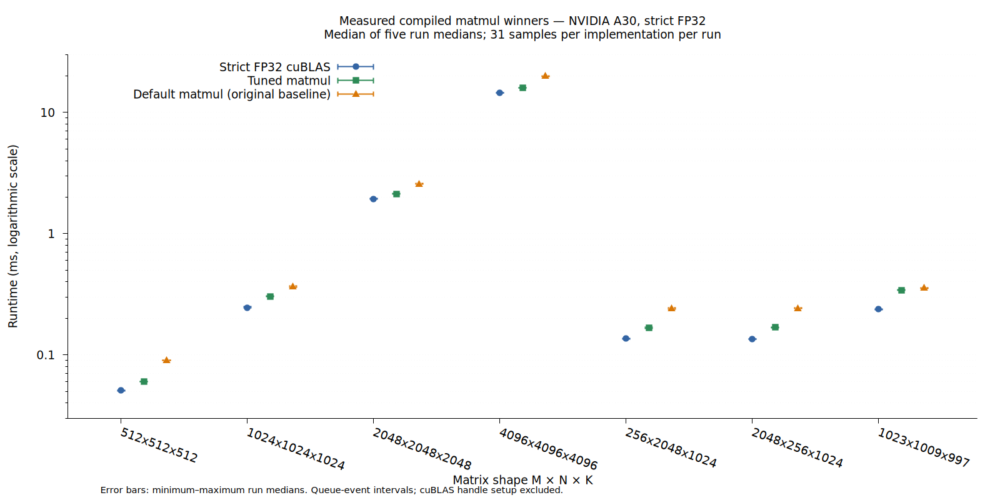
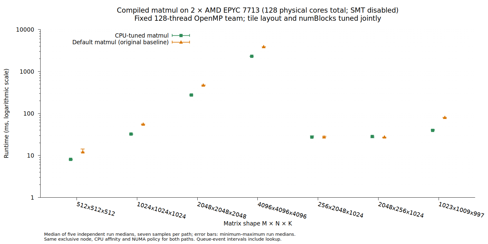
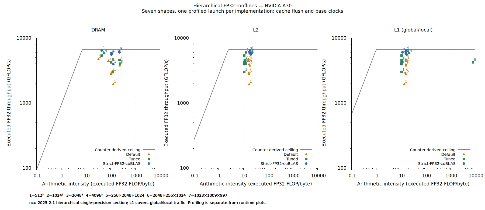

# Compiled matmul winners

This example uses the best configurations found by an alpakaTune FP32 GEMM
campaign. It computes `C = A * B` for owning, two-dimensional FP32 buffers:
`A[M,K]`, `B[K,N]`, and `C[M,N]`, in row-major order with contiguous columns.
Buffers must reside on the queue's device,
must not alias, and must remain alive until the queue completes.

```cpp
#include "Matmul.hpp"

// queue, executor and device-resident buffers belong to the application.
bool const usedWinner = alpakaTune::example::matmul::enqueueMatmul(
    queue, executor, a, b, c);
alpaka::onHost::wait(queue);
```

The call derives the matrix shape from the buffers and selects a precompiled
winner for **NVIDIA A30 / CUDA / gpuCuda** or **two AMD EPYC 7713 CPUs /
128 physical cores / OpenMP blocks** with a 128-thread OpenMP team. Disable
dynamic OpenMP teams and call from outside a parallel region when using the CPU
catalog. Every winner's matrix dimensions,
tile, register layout, thread count, and grid size are compile-time constants.
The shipped catalog contains only selected winners; no tuner is constructed at runtime.
Other shapes, devices, or executors use the original baseline and return `false`.
This fallback has a runtime grid size because its input shape is unknown.

`selectConfiguration(deviceName, apiName, executorName, shape, callback)` exposes
the same lookup for applications that need the configuration tag itself. The
callback receives the matching typed tag; the function returns `false` without
calling it when no key matches. The catalog is specific to this kernel and FP32
contract. For CPU lookup, pass `CpuContext{128, ompThreads}` after the callback;
`enqueueMatmul` obtains this context from the device and OpenMP configuration.
It does not predict winners for other hardware, OpenMP team sizes, or input shapes.

## Build and run

From the repository root, with a CUDA-capable compiler and toolkit:

```sh
cmake -S . -B build/matmul -DCMAKE_BUILD_TYPE=Release \
  -DalpakaTune_BUILD_EXAMPLES=ON -Dalpaka_DEP_CUDA=ON \
  -DCMAKE_CUDA_ARCHITECTURES=80 -Dalpaka_DEP_OMP=OFF
cmake --build build/matmul --target alpakaTune_matmul -j 2
build/matmul/example/matmul/alpakaTune_matmul \
  --backend cuda:nvidiaGpu --executor gpuCuda --repetitions 31 \
  --csv matmul-samples.csv
```

The executable compares the baseline, selected kernel, and direct strict FP32
cuBLAS. Add `--shape 4096x4096x4096` to select one shape, or repeat `--shape`.
Known device and OpenMP team contexts default to their recorded shapes; other keys
default to a small 64 × 128 × 32 fallback case.
Its output reports `compiled winner` or `baseline fallback` and median runtimes
in milliseconds. CSV rows retain every sample and whether a winner was selected.
The selected path's timing includes the public call's runtime lookup.

`alpakaTune::matmulExample` is an example-scoped header library target for other
applications in this build; it depends on alpaka and does not include tuner code.
The implementation remains under `example/matmul`; it is not an installed GEMM
API. Use `enqueueBaseline(queue, executor, a, b, c)` for the comparison baseline.

For the CPU comparison, configure an OpenMP build:

```sh
cmake -S . -B build/matmul-cpu -DCMAKE_BUILD_TYPE=Release \
  -DCMAKE_CXX_FLAGS_RELEASE='-O3 -DNDEBUG -march=znver2' \
  -DalpakaTune_BUILD_EXAMPLES=ON -Dalpaka_DEP_CUDA=OFF \
  -DalpakaTune_MATMUL_CUBLAS=OFF -Dalpaka_DEP_OMP=ON \
  -Dalpaka_DEP_HWLOC=OFF \
  -Dalpaka_EXEC_CpuSerial=OFF -Dalpaka_EXEC_CpuOmpBlocks=ON
cmake --build build/matmul-cpu --target alpakaTune_matmul -j 2
OMP_NUM_THREADS=128 OMP_DYNAMIC=FALSE OMP_PLACES=cores OMP_PROC_BIND=spread \
  build/matmul-cpu/example/matmul/alpakaTune_matmul \
  --backend host:cpu --executor cpuOmpBlocks --repetitions 7 \
  --csv matmul-cpu-samples.csv
```

The measured CPU catalog uses a full-node device with `alpaka_DEP_HWLOC=OFF`.
For CPU correctness, add `--self-test` to the same invocation. Alternatively, configure a serial
CPU build without CUDA or OpenMP and run:

```sh
build/matmul/example/matmul/alpakaTune_matmul \
  --self-test --backend host:cpu --executor cpuSerial
```

For concurrent CUDA correctness, use `--self-test --backend cuda:nvidiaGpu
--executor gpuCuda`. Tests check the lookup and fallback, all selected layouts,
aligned and irregular shapes, and full and one-block grids against an FP64 host
reference. A normal comparison checks boundary points and deterministic sampled
outputs. CPU tests do not establish GPU performance.

## Selected configurations

The **original default** being optimized is retained in `LegacyMatmulKernel`:
64 × 64 × 16 blocks, 4 × 4 registers per thread, one shared buffer,
256 threads, and the full output grid. It is the `default matmul` series below.
It is a tiled baseline, not an intentionally naive implementation.

All GPU winners use **128 threads**, K tiles of **32**, four-float
A shared-memory padding, register prefetching, and warp-oriented output mapping.
The tuning campaign also considered 256- and 512-thread configurations.

| Shape M × N × K | Block M × N × K | Registers per thread | Shared buffers | Grid blocks |
|---|---|---|---|---:|
| 512 × 512 × 512 | 32 × 64 × 32 | 4 × 4 | 1 | 128 |
| 1024 × 1024 × 1024 | 32 × 64 × 32 | 4 × 4 | 1 | 512 |
| 2048 × 2048 × 2048 | 32 × 64 × 32 | 4 × 4 | 1 | 2048 |
| 4096 × 4096 × 4096 | 64 × 128 × 32 | 8 × 8 | 1 | 2048 |
| 256 × 2048 × 1024 | 32 × 64 × 32 | 4 × 4 | 1 | 256 |
| 2048 × 256 × 1024 | 32 × 64 × 32 | 4 × 4 | 2, asynchronous | 256 |
| 1023 × 1009 × 997 | 32 × 64 × 32 | 4 × 4 | 1 | 512 |

## Measured runtime



The plot uses a logarithmic runtime axis to show both small and large matrices.
Points are medians of five independent application-run medians; error bars span
those five medians. Each run collected 31 samples per implementation and shape,
rotated implementation order, and alternated shape order. A GPU process watcher
checked every 0.5 seconds; no competing compute process was observed.

| Shape M × N × K | Default, ms | Tuned, ms | Strict FP32 cuBLAS, ms |
|---|---:|---:|---:|
| 512 × 512 × 512 | 0.090112 | 0.060416 | 0.051200 |
| 1024 × 1024 × 1024 | 0.365568 | 0.304128 | 0.245760 |
| 2048 × 2048 × 2048 | 2.569216 | 2.128896 | 1.935360 |
| 4096 × 4096 × 4096 | 19.995647 | 16.014336 | 14.507008 |
| 256 × 2048 × 1024 | 0.242688 | 0.167936 | 0.136192 |
| 2048 × 256 × 1024 | 0.242688 | 0.168960 | 0.135168 |
| 1023 × 1009 × 997 | 0.356352 | 0.340992 | 0.237568 |

For 4096 cubed, implementation changes and tuning reduced runtime by **19.9%**
against the original default (**1.25× faster**); the result took **10.4% longer
than cuBLAS**. For 256 × 2048 × 1024, the reduction was **30.8%** (**1.45× faster**).
These gains combine kernel improvements and configuration selection.

Measurements used an NVIDIA A30, GCC 14.3.0, CUDA toolkit 12.9.1
(`nvcc` 12.9.86), driver 610.57.04, CUDA architecture 80, and Release builds.
The alpaka revision was `b7d339d07056a9a2a6c4051cc3927157bc5f0d51`.
The selected layouts' arithmetic, storage mapping, and launch geometry are
retained from the tuning campaign. Follow-up shared-memory
permutations did not improve runtime and are omitted.

The native reference uses `cublasGemmEx`, `CUBLAS_COMPUTE_32F_PEDANTIC`,
`CUBLAS_PEDANTIC_MATH`, `alpha=1`, and `beta=0`, with one persistent handle
created outside timing. Both custom kernels use FP32 FMA; this comparison
excludes TF32 and tensor-core throughput. Timings are single-call queue-event
intervals, including submission gaps, rather than isolated profiler kernel times.
Allocations, transfers, correctness checks, and handle setup are outside timing.

The plotted tuned measurements use the complete public call, including the
buffer-shape/device lookup, in a separate evaluation after winner selection.
Performance depends on
hardware, compiler, software versions, and shape; these values are historical
measurements, not guarantees for a new build.

The portable [run medians](results/run-medians.csv) and
[aggregated plot data](results/runtimes.csv) retain the numeric evidence.
[Measurement provenance](results/provenance.txt) records source fingerprints
and build settings for both deployment comparisons.
Regenerate the PNG with gnuplot from `example/matmul/results`:

```sh
gnuplot runtime-comparison.gnuplot
```

## CPU optimization

The CPU campaign used an exclusively allocated node with **two AMD EPYC 7713
64-core CPUs: 128 physical cores total, SMT disabled, two NUMA domains**.
It tuned the same tile families used for CUDA, with one physical thread per
block and a fixed **128-thread OpenMP team** scheduling the blocks.
`numBlocks` is a tuning parameter independent of the team size: 256 blocks,
for example, schedule multiple blocks per CPU thread.
The sequential block implementation visits the logical GPU workers in rounds;
this example retains the GPU algorithm and is not a native CPU GEMM replacement.

The bounded exhaustive search started with nine layouts: 64 × 64 × {16,32,64},
128 × 128 × 16, 64 × 128 × {16,32}, and 32 × 64 × {16,32}, including the
original baseline and a double-buffer variant. It considered the full output
grid and grids capped at 64, 128, 256, 512, or 1024 blocks, removing duplicate
launch choices and excluding grids larger than the number of output tiles.
The main sweep covered 197 configurations across the seven shapes. A separate
rectangular sweep also included 64 × 32 × {16,32}, retesting all 24 legal
configurations for each rectangle together. The staged sweeps covered 209
distinct configurations, with 12–53 legal candidates per shape.
Every candidate was validated before timing. Screening ranked its four recorded
queue-event intervals; the tuner was configured for one warmup and three samples.
The two fastest were retested independently with three measured launches after
three warmups before freezing one winner per key. Search, finalist evaluation,
and deployment all used
compile-time tiles and launch parameters.

The CPU lookup key uses the model name, the device's reported 128 CPU processing
units, and the configured OpenMP team size. Those processing units correspond
to physical cores on the measured system because SMT was disabled. Other
OpenMP team sizes use the baseline. All seven shapes use the same allocated
128 cores and 128-thread team for both default and tuned measurements.
The baseline has only 64 output blocks for 512 cubed, so at most 64 threads do
useful block work in that case. Changing the tile layout can expose more blocks;
the table records both grid sizes rather than assuming all cores are always busy.

All CPU winners use **one physical thread per block** and a fixed 128-thread
OpenMP team. `numBlocks` controls the number of scheduled blocks. Layout IDs refer to this example's `tiles` array.

| OpenMP threads | Shape M × N × K | Layout | Block M × N × K | Registers per logical GPU thread | Shared buffers | Default blocks | Tuned `numBlocks` |
|---:|---|---:|---|---|---:|---:|---:|
| 128 | 512 × 512 × 512 | 4 | 32 × 64 × 16 | 4 × 4 | 1 | 64 | 128 |
| 128 | 1024 × 1024 × 1024 | 3 | 64 × 128 × 32 | 8 × 8 | 1 | 256 | 128 |
| 128 | 2048 × 2048 × 2048 | 3 | 64 × 128 × 32 | 8 × 8 | 1 | 1024 | 512 |
| 128 | 4096 × 4096 × 4096 | 3 | 64 × 128 × 32 | 8 × 8 | 1 | 4096 | 2048 |
| 128 | 256 × 2048 × 1024 | 0 | 64 × 64 × 16 | 4 × 4 | 1 | 128 | 128 |
| 128 | 2048 × 256 × 1024 | 0 | 64 × 64 × 16 | 4 × 4 | 1 | 128 | 128 |
| 128 | 1023 × 1009 × 997 | 3 | 64 × 128 × 32 | 8 × 8 | 1 | 256 | 128 |

Warp-oriented layouts use four-float A padding and register prefetching;
the original baseline keeps its unpadded layout. CPU copies are synchronous.

Both rectangular keys retain the original baseline layout and grid. Timing
differences between their plotted paths are repeated measurements of that same
configuration, rather than an implementation improvement.



CPU timing uses five fresh application processes with the same 128-thread team,
seven samples per path and shape, rotating path order and alternating shape order.
Points are medians of run medians, and error bars span those medians. CPU threads
were bound to physical cores with `OMP_PLACES=cores`, `OMP_PROC_BIND=spread`,
and `OMP_DYNAMIC=FALSE`; memory was interleaved across both NUMA domains.
Allocation, transfers, reference calculation, validation, and team verification
are outside timing. The measured tuned call includes shape, device, and OpenMP
team lookup and has no tuner or replay machinery.

| Shape M × N × K | Default, ms | Tuned, ms | Time reduction | Speedup vs default |
|---|---:|---:|---:|---:|
| 512 × 512 × 512 | 12.112725 | 8.067279 | 33.4% | 1.50× |
| 1024 × 1024 × 1024 | 55.536019 | 32.134035 | 42.1% | 1.73× |
| 2048 × 2048 × 2048 | 469.013754 | 276.333979 | 41.1% | 1.70× |
| 4096 × 4096 × 4096 | 3845.152201 | 2297.162788 | 40.3% | 1.67× |
| 256 × 2048 × 1024 | 27.507212 | 27.450234 | 0.2% | 1.00× |
| 2048 × 256 × 1024 | 27.361273 | 28.308319 | -3.5% | 0.97× |
| 1023 × 1009 × 997 | 79.261225 | 39.730679 | 49.9% | 1.99× |

The largest measured reduction was **49.9%** (**1.99× faster**) for 1023 × 1009 × 997.
These results combine kernel changes, tile selection, and `numBlocks` tuning
with the same CPU allocation and OpenMP team size.
Negative reductions indicate slower execution; 2048 × 256 × 1024 did not improve in the final deployment comparison.


Both search and deployment used GCC 14.3.0, `-O3 -DNDEBUG -march=znver2`,
OpenMP, and the same alpaka revision as the GPU comparison. The execution
node supplied GCC 14.2.0 runtime libraries. FP64 host-reference checks passed
for every screened candidate; the deployed layouts also passed full-output
correctness tests, and each timed shape passed sampled validation.

The [CPU run medians](results/cpu-run-medians.csv) and
[CPU plot data](results/cpu-runtimes.csv) retain the numeric evidence.
Regenerate the additional PNG from `example/matmul/results` with:

```sh
gnuplot cpu-runtime-comparison.gnuplot
```

## Hierarchical GPU rooflines



The rooflines use Nsight Compute 2025.2.1's
`SpeedOfLight_HierarchicalSingleRooflineChart` section for all seven shapes
and three implementations. Each point is one kernel launch after correctness
validation and three warmups per implementation. Profiling flushes caches before
replay and locks base clocks; these measurements are separate from the runtime
comparison above. GPU contention monitoring remained active during collection.

The chart reproduces [NVIDIA's hierarchical roofline definitions](https://docs.nvidia.com/nsight-compute/ProfilingGuide/index.html):
executed FP32 throughput counts FADD + FMUL + twice FFMA and multiplies by the
measured SM clock. Each level's arithmetic intensity divides that throughput
by its measured bandwidth. DRAM uses `dram__bytes.sum.per_second`; L2 uses
32 bytes per L2-to-crossbar active cycle; L1 uses 128 bytes per global/local
LSU writeback active cycle. The L1 panel covers global/local traffic; shared-memory
bank conflicts are outside this roofline. Executed operations include padding
and are different from useful GEMM throughput computed as `2*M*N*K/time`.

[Counter metrics](results/roofline-metrics.csv) use SI units: seconds, Hz,
bytes, bytes/s, and instructions/cycle as applicable.
[Derived points](results/roofline-points.csv) retain each launch's ceiling;
the drawn ceilings use the medians of all 21 launches, recorded in
[roofline-ceilings.csv](results/roofline-ceilings.csv). Regenerate the PNG with
`gnuplot hierarchical-roofline.gnuplot` from `results/`.

For 4096³, executed throughput is 4.70 TFLOP/s for default matmul,
5.84 TFLOP/s for tuned matmul, and 6.43 TFLOP/s for strict FP32 cuBLAS.
All three hierarchy points lie beyond their bandwidth/compute intersections.
This comparison does not identify shared-memory stalls or another specific
cause of the remaining performance gap.
